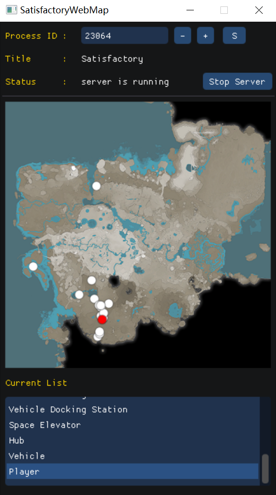

# SatisfactoryWebMap

## Installation

### Download executable

Download from [here](https://github.com/nideii/SatisfactoryWebMap/releases) and start the game and run the .exe

### Compile from source

Dwonload the repo and open in Visual Studio, and hit compile. Make sure the target platform is X64. Only tested under VS2019.

The HTML file is under `\x64\Debug\web`, you might want to copy the `web` folder to the same directory as the .exe file.

## Usage

The program will check for Satisfactory process. If it dose not find the correct process, you can enter the PID yourself. The `S` button is force to search again.

And then you can hit `Start Server`, and hopefully the server start running.

Recommend start the save first, since the game object will not be avaiable until you start playing the game or `invalid obj` error message will be shown.

After the server start running, you should see something like this. And you can open your browser for `http://localhost:7012` or `http://<your IP>:7012` the map.

### Known Issues

Exiting the game without stopping the server will crash the game after the game exit. It should not hurt anything, but use it at your own risk.

## How it works?

The program inject a dll that could read Satisfactory internal data and the find out where the thing locate in the world. 
It dose not modify any game data, but in case of an update will break the program and cause the program to crash.

Then the dll starts a HTTP Web server on port 7012. The web page uses leaflet and some plugins.

A custom web page could be dropped into `\web` folder under the .exe file.

The data is in GeoJSON format, and you could use other GIS software like ArcGIS.

There are only two HTTP API now

### Web APIs

+ GET `/api/actors`

Return the location of objects in the game in GeoJSON format. Only supporting `Point` now.

There is an additional `status` field should the results. `ok` when success, `err` when failed. The error message will be in `msg` field.

+ GET `/api/stop`

Kill the server. No return message.
